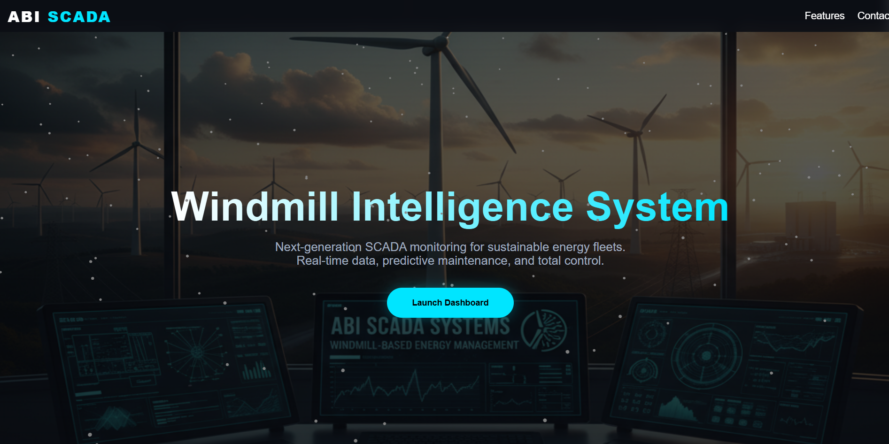
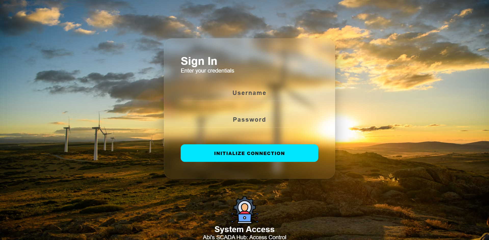
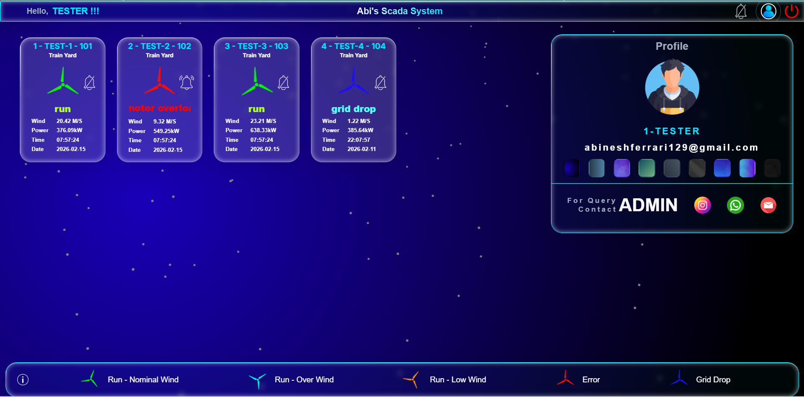
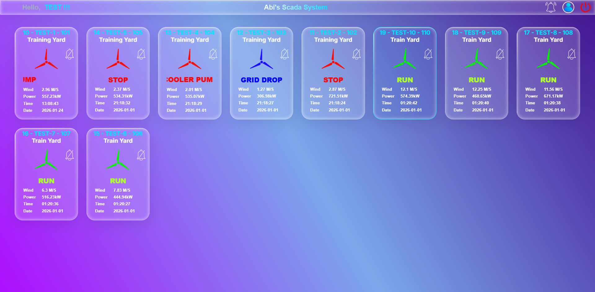
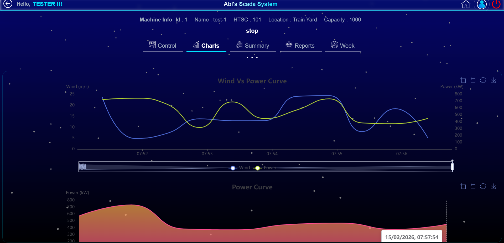

# ScadaApp

A full-stack SCADA (Supervisory Control and Data Acquisition) web application built with a Python backend and React frontend.
This project provides a web-based interface for monitoring, visualization, and management of industrial or IoT data systems.

---

## 🚀 Features

* Real-time monitoring dashboard
* Secure backend APIs
* React-based interactive UI
* Modular backend architecture
* SCADA-style data visualization
* Extensible for IoT / industrial integration

---

## 🏗️ Project Structure

```
ScadaApp/
│
├── Backend/              # Python backend services & APIs
│   ├── security/         # Authentication / security modules
│   ├── templates/        # Backend templates
│   └── *.py              # Backend source files
│
├── Frontend/
│   └── myscada/          # React application
│       ├── src/          # React components & logic
│       ├── public/       # Static assets
│       ├── package.json
│       └── package-lock.json
│
├── .gitignore
├── README.md
```

---

## ⚙️ Backend Setup (Python)

### 1️⃣ Create virtual environment

```bash
python -m venv .venv
```

### 2️⃣ Activate environment

**Windows (PowerShell)**

```powershell
.venv\Scripts\activate
```

**Linux / Mac**

```bash
source .venv/bin/activate
```

### 3️⃣ Install dependencies

```bash
pip install -r requirements.txt
```

### 4️⃣ Run backend

```bash
cd /backend
uvicorn main:app --reload
```

Backend runs on:

```
http://localhost:8000
```

---

## 💻 Frontend Setup (React)

Navigate to frontend:

```bash
cd Frontend/myscada
```

Install packages:

```bash
npm install
```

Run development server:

```bash
npm start
```

Frontend runs on:

```
http://localhost:3000
```

---

## 🔗 Backend–Frontend Integration

The React frontend communicates with the Python backend via REST APIs.

Example flow:

```
React UI → HTTP request → Python API → Data → React UI
```

---

## 📦 Dependencies

Frontend:

* React
* Node.js
* npm

Backend:

* Python 3.x
* Flask / FastAPI (depending on modules)
* Other packages in `requirements.txt`

---

## 🛠️ Development Workflow

Run backend:

```bash
python app.py
```

Run frontend:

```bash
cd Frontend/myscada
npm start
```

---

## 📸 Screenshots

*Add UI screenshots here*













---

## 🔒 Security

* Modular security layer in `Backend/security`
* Supports authentication extension
* Ready for role-based access control

---

## 🌐 Future Improvements

* Real-time WebSocket data streaming
* Device integration (PLC / IoT)
* Alarm management system
* Historical data charts
* Deployment to cloud/VPS

---

## 👨‍💻 Author

**Abinesh**
GitHub: https://github.com/abineshferrari

---

## 📄 License

This project is for educational and development purposes.
